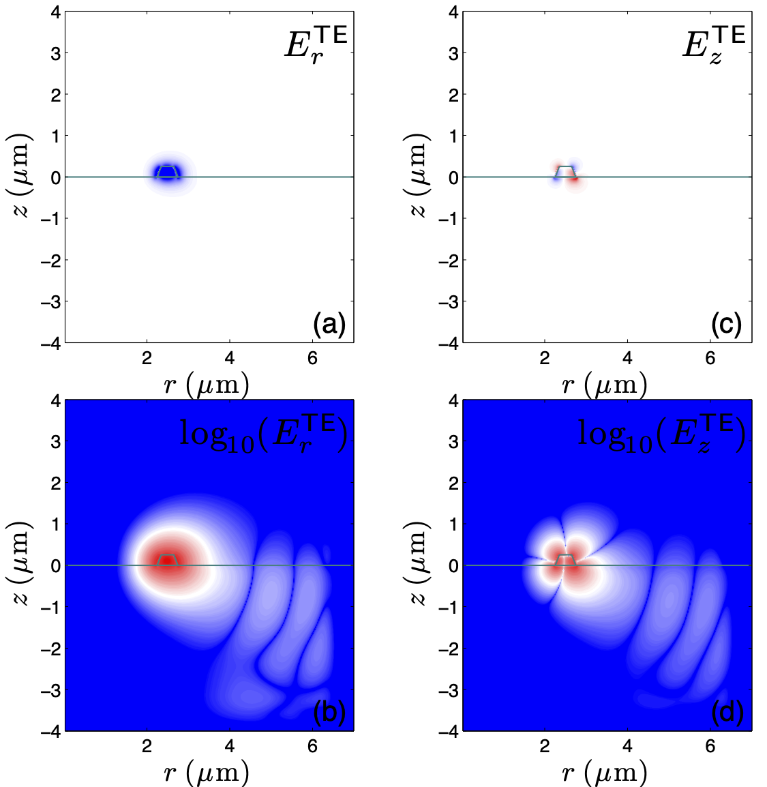
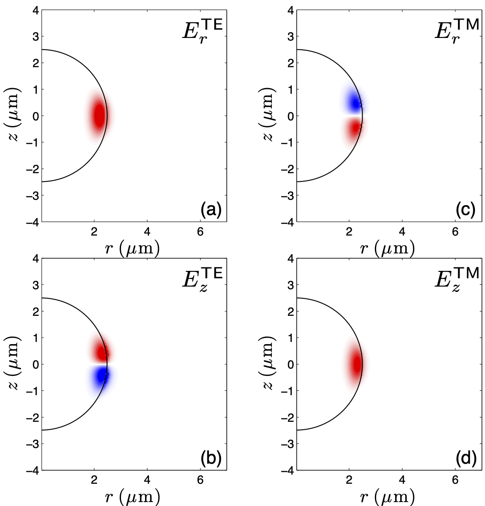

## Full vectorial electromagnetic waveguide mode solver

### Introduction

The code in this repository aims to solve two specific eigenvalue
problems commonly encountered in engineering electromagnetic
(including nanophotonic) waveguides and resonators. The code was
originally written in MATLAB and has been recently verified to work in
Octave.

### Background: electromagnetic eigenvalue problems

Eigenvalue problems (or computations) in electromagnetic engineering
are encountered in two forms: eigenmode and eigenfrequency. Both forms
have the same parent eigenvalue equation, which we call the Master
equation. The Master equation is derived from time-harmonic Maxwell's
equations and its detailed derivation is shown in the appendix section
of the [paper](paper/publication.pdf). An eigenmode problem results
when the operating wavelength is fixed and we solve the Master
equation for the allowed mode index(es) at that wavelength.
Conversely, an eigenfrequency problems results when we fix the mode
index and solve the master equation for the allowed resonant
frequencies in the photonic structure.

Mathematically, the structure of the full vectorial electromagnetic
eigenvalue problem is:

    
    
 

In the eigenmode problem the frequency &omega; (or wavelength) is
known, we move it to the left hand side and solve for the mode index
&nu;. This situation applies to the computation of the propagating
modes of the waveguides or optical fibers. When the mode index &nu; is
known, we move that to the left hand side and solve for the resonant
frequency &omega;. This situation applies to the computation of the
resonant frequencies of microring, microdisk and microsphere
resonators. In both cases the solution of the eigenvalue problem
yields the eigenvalue itself (mode index or the resonant frequency)
and the eigenvectors (the modal or resonant fields). 

**Full vectorial** refers to including the cross terms in the LHS
matrix. The two field components are coupled due to the cross terms.
**Semi vectorial** refers to excluding the cross terms (and hence the
coupling) and computing the mode indices or resonant frequencies and
their associated fields using only the diagonal terms. Semivectorial
solution reduces the computation by one fourth at the expense of loss
of accuracy. For large structures with linear materials,
semivectorial solution may be enough. For small components with high
refractive indices a full vectorial solution may be needed. The
present code implements only a full vectorial solution. If a faster,
semivectorial solution is desired, it is straightforward to modify
the code. 

### Cartesian and cylindrically-symmetric solution modes

### Installation and execution

To install, simply clone or download the code. The core mathematics is
implemented in the files contained in `/lib/cyl` and `/lib/cart`. The
`apps` directory shows how to simulate commonly encountered waveguide
structures. We have included examples for rectangular waveguide on a
substrate, an optical fiber, a microring resonator, a microdisk
resonator and a microsphere resonator.  

You can run these examples either via bash commandline, Octave
console, or via the Octave GUI. For example, to run the microdisk example
(`microdisk.m`) via the commandline, type

    # Make sure you're in the `apps` directory
    $ cd apps
    $ octave microdisk.m

To run the same example via Octave console, start Octave

    # Make sure you're in the `apps` directory
    $ cd apps
    $ octave

This will open the octave console. You can type the name of the
desired application `microdisk` and wait for the computation to
finish. 

To run the same example via Octave GUI, start Octave GUI

    # Make sure you're in the `apps` directory
    $ cd apps
    $ octave --gui

    
    
 

This will open the octave console. You can type the name of the
desired application `microdisk` and wait for the computation to
finish. 

One advantage of using the console or the GUI is that the computed
output stays in the memory and you can explore it further, for example
by plotting the fields or creating additional info for your report or
publication.

### Plotting

The code includes basic field plotting facilities. The main function
for plotting the fields is `plot_modes()` That function accepts the
input and output structures (`IN`,  `OUT`), the list of solution to be
plotted (e.g. `[1 5 9 20]`) and the plotting scale (`lin` or `log`).
Code in the `paper` folder reproduces the figures in the publication.

### Gallery

#### Fields and radiation of a microdisk resonator

    
    
 

#### Fields and radiation of a microring resonator

    
    
 

#### TE/TM fields of microsphere resonator

    
    
 

